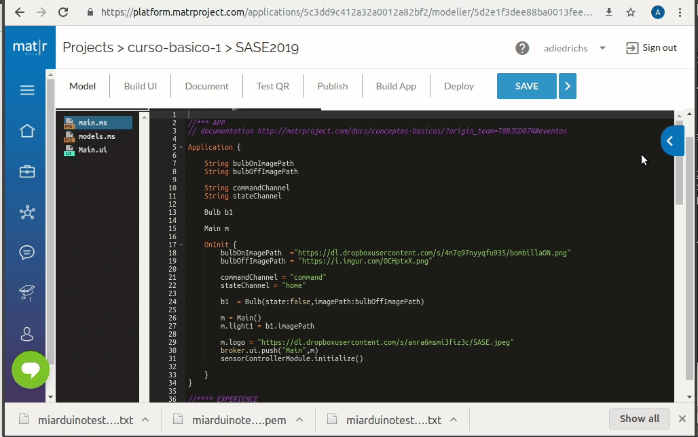
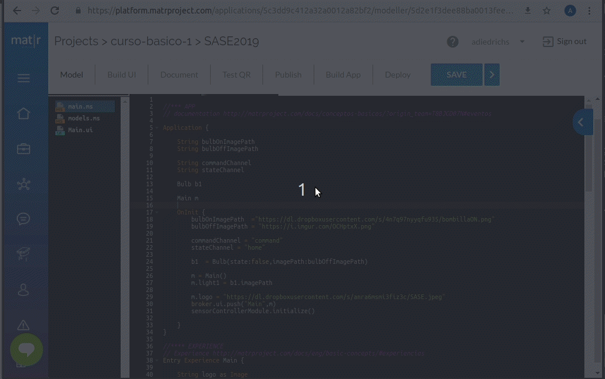

# Matr IoT App

## SASE2019

Busca en el Matr Hub la app SASE2019.
Realiza un Fork de la misma

## Canales

Crea los canales MQTT




## Dispositivo

Configura un dispositivo y se descargarán los certificados. ¡Consérvalos!
Estos certificados luego se guardaran en tu placa nodeMCU




## Test you Mat|r app with mosquitto - SASE2019-tutorial example

Para probar la aplicación sin necesidad de usar hardware, puedes usar mosquitto.

### Channel home

Canal de monitoreo *home*

Comando

```
mosquitto_pub -h a2sq3y7mdrjtom.iot.us-east-1.amazonaws.com -p 8883 -t a8cb7cc3 --cert arduinotest.certificate.pem  --key arduinotest.private-key.txt --cafile rootCA.pem -m '{"bulb1State":true,"temp":30,"hum":60}' -d

```

Salida esperada:

```
Client mosq/8dp2QyRi0ECSi7SBYF sending CONNECT
Client mosq/8dp2QyRi0ECSi7SBYF received CONNACK (0)
Client mosq/8dp2QyRi0ECSi7SBYF sending PUBLISH (d0, q0, r0, m1, 'a8cb7cc3', ... (38 bytes))
Client mosq/8dp2QyRi0ECSi7SBYF sending DISCONNECT
```
### Channel command

Canal de envío de comando para prender y apagar leds.

Comando

```bash
mosquitto_sub -h a2sq3y7mdrjtom.iot.us-east-1.amazonaws.com -p 8883 -t 3dff80bb --cert arduinotest.certificate.pem  --key arduinotest.private-key.txt --cafile rootCA.pem -d
```
Salida esperada 
```
Client mosq/cerdx5GO7JNgL06dFq sending CONNECT
Client mosq/cerdx5GO7JNgL06dFq received CONNACK (0)
Client mosq/cerdx5GO7JNgL06dFq sending SUBSCRIBE (Mid: 1, Topic: 3dff80bb, QoS: 0, Options: 0x00)
Client mosq/cerdx5GO7JNgL06dFq received SUBACK
Subscribed (mid: 1): 0
Client mosq/cerdx5GO7JNgL06dFq received PUBLISH (d0, q0, r0, m0, '3dff80bb', ... (39 bytes))
{"command":"TOGGLE-RELAY","relayIdx":1}
Client mosq/cerdx5GO7JNgL06dFq received PUBLISH (d0, q0, r0, m0, '3dff80bb', ... (39 bytes))
{"command":"TOGGLE-RELAY","relayIdx":1}
Client mosq/cerdx5GO7JNgL06dFq received PUBLISH (d0, q0, r0, m0, '3dff80bb', ... (39 bytes))
{"command":"TOGGLE-RELAY","relayIdx":1}
```

